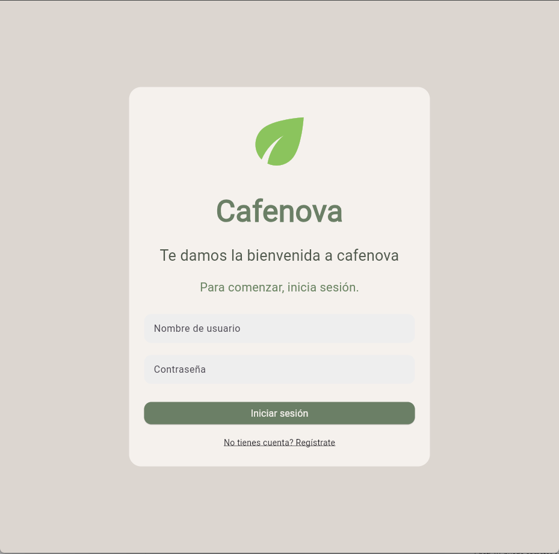
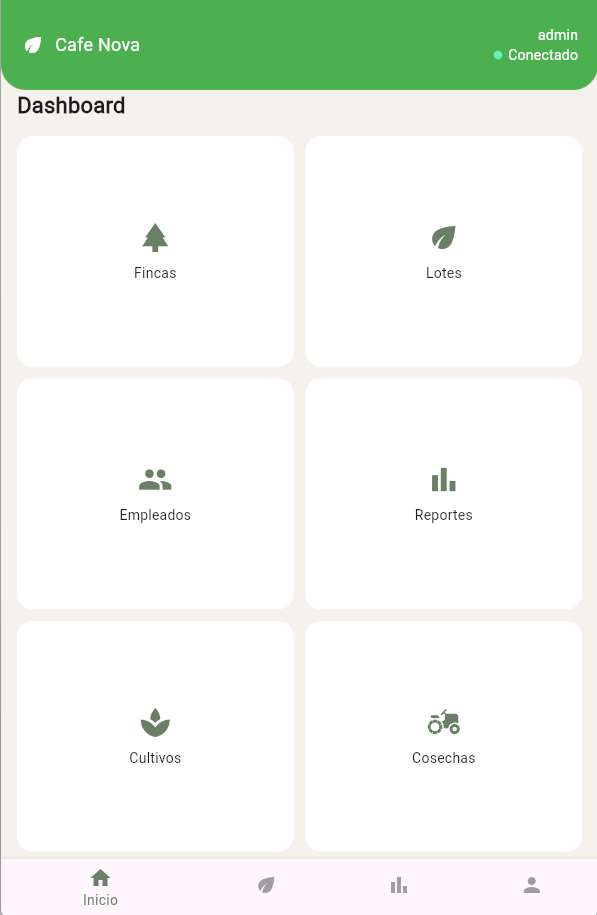
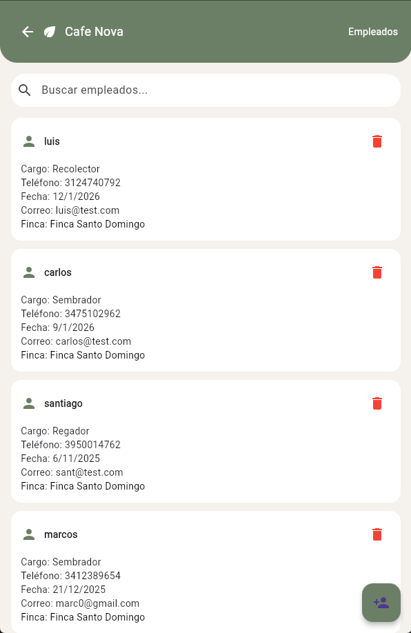
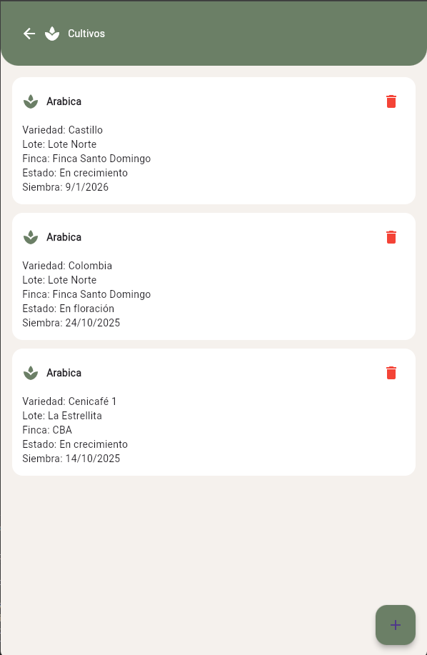
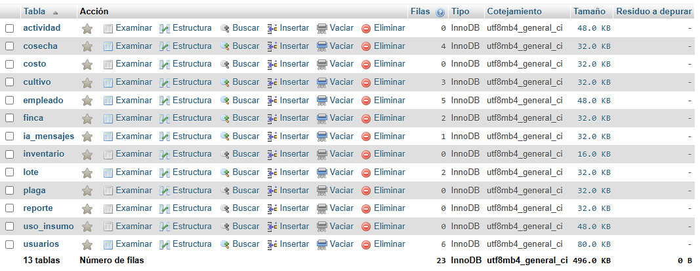
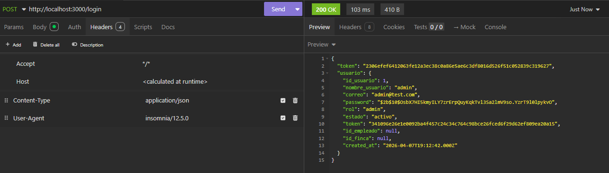

# ☕ CafeNova-App

Sistema de gestión integral para fincas cafeteras desarrollado como proyecto académico del SENA, enfocado en la administración de usuarios, empleados, fincas, cultivos, lotes, cosechas y reportes mediante una aplicación moderna construida con Flutter y Node.js.

---

# 📖 Descripción

CafeNova-App es una aplicación desarrollada para optimizar la gestión y administración de procesos agrícolas relacionados con fincas cafeteras.

El sistema permite centralizar información importante como:

- Usuarios
- Empleados
- Fincas
- Lotes
- Cultivos
- Cosechas
- Reportes
- Inteligencia Artificial

facilitando el control y seguimiento de la información desde una interfaz moderna e intuitiva.

El proyecto se encuentra dividido en:

- Frontend desarrollado en Flutter.
- Backend desarrollado con Node.js y Express.
- Base de datos MySQL.

---

# 👥 Integrantes

- Carol Sofia Realpe
- Luis Carlos Latorre Berdugo

---

# 🏗️ Arquitectura del proyecto

CafeNova-App utiliza una arquitectura Full Stack compuesta por:

## Frontend
Aplicación desarrollada en Flutter compatible con:
- Android
- Web
- Windows
- Linux
- macOS
- iOS

## Backend
Servidor API REST desarrollado con Node.js y Express encargado de:
- Procesamiento lógico
- Manejo de autenticación
- Gestión de datos
- Integración IA
- Comunicación con MySQL

## Base de datos
Sistema gestor de base de datos MySQL.

## Comunicación
Frontend y backend se comunican mediante peticiones HTTP utilizando servicios API REST.

---

# 🛠️ Tecnologías utilizadas

## Frontend
- Flutter
- Dart

## Backend
- Node.js
- Express.js

## Base de datos
- MySQL

## Librerías y herramientas Backend
- dotenv
- cors
- mysql2
- nodemon
- express

## Librerías y herramientas Frontend
- flutter/material

## Herramientas de desarrollo
- Git
- GitHub
- Visual Studio Code
- Android Studio
- MySQL Workbench

---

# 📂 Estructura del proyecto

```bash
CafeNova-App/
│
├── backend/
│   │
│   ├── src/
│   │   ├── config/
│   │   │   └── db.js
│   │   │
│   │   ├── controllers/
│   │   │   ├── authController.js
│   │   │   ├── cosechasController.js
│   │   │   ├── cultivosController.js
│   │   │   ├── empleadosController.js
│   │   │   ├── fincasController.js
│   │   │   ├── iaController.js
│   │   │   ├── lotesController.js
│   │   │   ├── reportesController.js
│   │   │   └── usuariosController.js
│   │   │
│   │   ├── middleware/
│   │   │   └── auth.js
│   │   │
│   │   ├── routes/
│   │   │   ├── auth.js
│   │   │   ├── cosechas.js
│   │   │   ├── cultivos.js
│   │   │   ├── empleados.js
│   │   │   ├── fincas.js
│   │   │   ├── ia.js
│   │   │   ├── lotes.js
│   │   │   ├── reportes.js
│   │   │   └── usuarios.js
│   │   │
│   │   └── app.js
│   │
│   ├── index.js
│   ├── package.json
│   ├── package-lock.json
│   ├── .gitignore
│   └── .env.example
│
├── frontend/
│   │
│   ├── android/
│   ├── ios/
│   ├── linux/
│   ├── macos/
│   ├── windows/
│   ├── web/
│   ├── test/
│   │
│   ├── lib/
│   │   │
│   │   ├── screens/
│   │   │   ├── IA_screen.dart
│   │   │   ├── cosecha_screen.dart
│   │   │   ├── cultivos_screen.dart
│   │   │   ├── employees_screen.dart
│   │   │   ├── finca_screen.dart
│   │   │   ├── home_screen.dart
│   │   │   ├── login_screen.dart
│   │   │   ├── lotes_screen.dart
│   │   │   ├── profile_screen.dart
│   │   │   ├── register_screen.dart
│   │   │   ├── reportes_screen.dart
│   │   │   └── usuarios_pendientes_screen.dart
│   │   │
│   │   ├── services/
│   │   │   ├── api_service.dart
│   │   │   └── session_service.dart
│   │   │
│   │   ├── utils/
│   │   │   └── mensajes.dart
│   │   │
│   │   ├── widgets/
│   │   │   └── app_bottom_nav.dart
│   │   │
│   │   └── main.dart
│   │
│   ├── pubspec.yaml
│   ├── pubspec.lock
│   ├── analysis_options.yaml
│   └── README.md
│
├── database/
│   └── cafenova.sql
│
└── README.md
```

---

# ⚙️ Requisitos previos

Antes de ejecutar el proyecto debes tener instalado lo siguiente:

## Generales
- Git
- Visual Studio Code

## Frontend
- Flutter SDK
- Dart SDK
- Android Studio

## Backend
- Node.js
- npm

## Base de datos
- MySQL Server
- MySQL Workbench

---

# 📥 Instalación

## 1. Clonar el repositorio

```bash
git clone https://github.com/LuisP2Git/CafeNova-App.git
```

---

## 2. Entrar al proyecto

```bash
cd CafeNova-App
```

---

# ▶️ Ejecución local

# 🔹 Backend

## Entrar a la carpeta backend

```bash
cd backend
```

## Instalar dependencias

```bash
npm install
```

## Ejecutar servidor

```bash
npm run dev
```

o

```bash
node index.js
```

El backend se ejecutará normalmente en:

```txt
http://localhost:3000
y
https://cafenova-app-production.up.railway.app
```

---

# 🔹 Frontend

## Entrar a la carpeta frontend

```bash
cd frontend
```

## Instalar dependencias

```bash
flutter pub get
```

## Ejecutar aplicación

```bash
flutter run
```

---

# 🌐 Flutter Web

## Generar compilación web

```bash
flutter build web
```

La compilación final se genera en:

```txt
frontend/build/web
```

---

# 🗄️ Base de datos

## Crear la base de datos

```sql
CREATE DATABASE cafenova;
```

---

## Importar el archivo SQL

El archivo SQL se encuentra en:

```txt
/database/cafenova.sql
```

Puede importarse utilizando:

- MySQL Workbench
- phpMyAdmin
- Línea de comandos MySQL

---

# 🔐 Variables de entorno

Crear un archivo `.env` dentro de:

```txt
/backend/.env
```

## Ejemplo:

```env
PORT=3000

DB_HOST=localhost
DB_USER=root
DB_PASSWORD=tu_contraseña
DB_NAME=cafenova
DB_PORT=3306

GEMINI_API_KEY=tu_api_key
```

---

## Archivo recomendado

Crear también:

```txt
/backend/.env.example
```

---

## Descripción de variables

| Variable | Descripción |
|---|---|
| PORT | Puerto del servidor |
| DB_HOST | Dirección del servidor MySQL |
| DB_USER | Usuario de MySQL |
| DB_PASSWORD | Contraseña de MySQL |
| DB_NAME | Nombre de la base de datos |
| DB_PORT | Puerto de MySQL |
| GEMINI_API_KEY | Clave API para integración IA |

---

# 👤 Usuario de prueba

```txt
Correo:
admin@cafenova.com

Contraseña:
Admin123*
```

---

# 📱 Módulos principales

## Seguridad y autenticación
- Inicio de sesión
- Registro de usuarios
- Middleware de autenticación
- Manejo de sesiones

## Gestión administrativa
- Gestión de empleados
- Gestión de usuarios
- Usuarios pendientes

## Gestión agrícola
- Gestión de fincas
- Gestión de lotes
- Gestión de cultivos
- Gestión de cosechas

## Reportes
- Reportes administrativos
- Reportes agrícolas

## Inteligencia Artificial
- Módulo IA integrado
- Procesamiento mediante API

---

# 🚀 Despliegue

## Frontend
Plataforma seleccionada:
- Vercel

## Backend
Plataforma seleccionada:
- Render

## Base de datos
Plataforma seleccionada:
- Railway MySQL

---

# 📌 Justificación del despliegue

## Vercel
Permite desplegar aplicaciones Flutter Web de forma rápida y automática conectando directamente el repositorio GitHub.

## Render
Compatible con aplicaciones Node.js y APIs REST permitiendo despliegue automático, logs y variables de entorno.

## Railway
Permite alojar bases de datos MySQL en la nube para proyectos académicos y pruebas.

---

# 🧪 Pruebas realizadas

- Inicio de sesión
- Registro de usuarios
- CRUD de empleados
- CRUD de cultivos
- CRUD de lotes
- CRUD de fincas
- CRUD de cosechas
- Generación de reportes
- Integración backend/frontend
- Conexión MySQL
- Consumo API REST
- Integración IA

---

# 💡 Recomendaciones

## Backend
- No subir `node_modules`
- No subir `.env`
- Validar correctamente los datos enviados desde frontend
- Mantener organizada la estructura de rutas y controladores

## Frontend
- Mantener organizada la estructura de pantallas y servicios
- Reutilizar widgets y componentes
- Optimizar consumo de API

## Base de datos
- Realizar copias de seguridad periódicas
- Mantener relaciones correctamente definidas
- Usar credenciales seguras

## GitHub
- Realizar commits organizados
- Documentar cambios importantes
- Utilizar ramas para nuevas funcionalidades

---

# ⚠️ Riesgos identificados

| Riesgo | Mitigación |
|---|---|
| Error de conexión MySQL | Revisar variables de entorno |
| Error de build Flutter | Validar SDK y dependencias |
| API no responde | Revisar logs Render |
| Variables incorrectas | Revisar `.env` |
| Error de despliegue | Validar configuración GitHub |

---

# 🔄 Plan de reversa

En caso de fallo durante despliegue:

1. Restaurar versión estable desde GitHub.
2. Reimportar backup SQL.
3. Revertir último despliegue.
4. Revisar logs y corregir errores antes de republicar.

---

# 📸 Evidencias

## 🔐 Inicio de sesión



---

## 🏠 Pantalla principal



---

## 👷 Gestión de empleados



---

## 🌱 Gestión de cultivos



---

## 🗄️ Base de datos MySQL



---

## ⚙️ Pruebas de API en Insomnia



---

# 📌 Estado del proyecto

🚧 Proyecto académico en desarrollo y mejora continua.

Actualmente el sistema cuenta con:

- Frontend Flutter funcional
- Backend API REST operativo
- Base de datos MySQL integrada
- Arquitectura Full Stack
- Integración IA
- Reportes administrativos
- Gestión agrícola completa

---

# 📄 Licencia

Este proyecto fue desarrollado con fines académicos para el SENA.

Licencia de uso educativo y demostrativo.

© 2026 CafeNova-App
